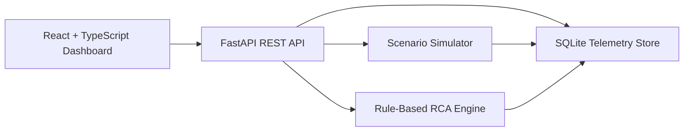

# TraceSentry

TraceSentry is a full-stack observability dashboard that simulates distributed-system incidents, visualizes service health, and explains likely root causes with rule-based analysis.

It is built as a recruiter-ready portfolio project for software engineering, backend, networking, DevOps, cybersecurity, and AI/ML-adjacent internship applications. The system uses only synthetic data and runs locally without paid APIs or external services.

## Why I Built This

Most portfolio projects show CRUD workflows. TraceSentry is different: it models how engineers monitor services, inspect logs and metrics, reason about dependencies, and communicate incident response decisions.

I built it to demonstrate practical distributed-systems thinking with a full-stack implementation: a Python/FastAPI backend, a SQLite telemetry store, a React/TypeScript dashboard, Dockerized local development, and deterministic root-cause analysis.

## Features

- Simulates a six-service system: `api-gateway`, `auth-service`, `user-service`, `payment-service`, `notification-service`, and `database`
- Shows overall system status, active incidents, average latency, error rate, and throughput
- Displays polished service health cards with status, dependency, and metric summaries
- Visualizes service dependencies with React Flow and status-aware nodes
- Charts latency, error rate, and throughput over time with Recharts
- Generates synthetic incidents, logs, and metrics from local simulation scenarios
- Provides an incident timeline with severity, affected service, root cause, and explanation
- Explains likely root cause, affected downstream services, suggested fix, runbook steps, and anomaly scores
- Supports service and severity filtering in the logs table
- Includes FastAPI endpoints, Pydantic response models, SQLite seed data, Docker, Docker Compose, and GitHub Actions CI

## Tech Stack

| Layer | Tools |
| --- | --- |
| Frontend | React, TypeScript, Vite, Tailwind CSS, React Flow, Recharts, Lucide React |
| Backend | Python, FastAPI, SQLite, Pydantic |
| Simulation/RCA | Rule-based logic, rolling baseline comparison, z-score style anomaly scoring |
| DevOps | Docker, Docker Compose, GitHub Actions |
| Testing/Quality | Pytest, Ruff, ESLint, TypeScript build |

## Architecture Overview



TraceSentry starts with healthy seeded telemetry. When a scenario is triggered, the backend restores the service baseline, applies the selected failure pattern, inserts a metric snapshot, writes professional synthetic logs, creates an incident, and runs root-cause analysis. The frontend refreshes service cards, dependency graph, charts, logs, incident timeline, and RCA details.

## System Simulation

The simulator models a small internal platform:

| Service | Role | Dependencies |
| --- | --- | --- |
| `api-gateway` | Entry point for client traffic | auth-service, user-service, payment-service, notification-service |
| `auth-service` | Token verification and authentication | database |
| `user-service` | User profile reads | database |
| `payment-service` | Checkout and authorization flow | database |
| `notification-service` | Delivery and receipt notifications | none |
| `database` | Shared persistence layer | none |

Each service tracks:

- status: `healthy`, `degraded`, or `down`
- latency in milliseconds
- error rate
- throughput in requests per minute
- dependencies
- last seen timestamp

## Root Cause Analysis

TraceSentry does not use an LLM. RCA is deterministic and explainable.

The backend combines:

- Dependency-aware rules for upstream/downstream impact
- Rolling metric history from SQLite
- Z-score style anomaly scoring for latency, error rate, and throughput
- Scenario-independent checks for common operational failures
- Plain-English explanations and runbook steps

Example: if database latency spikes and direct dependents such as `user-service` and `payment-service` degrade, TraceSentry identifies the database as the likely upstream bottleneck and recommends checking slow queries, connection pool saturation, and recent migrations.

## Simulation Scenarios

| Scenario | What Happens | Expected Root Cause |
| --- | --- | --- |
| `database_latency` | Database latency spikes; user and payment paths degrade | Database bottleneck |
| `auth_failure` | Auth-service errors rise; gateway shows failed authenticated requests | Authentication service failure |
| `payment_timeout` | Payment-service becomes unavailable; checkout logs show timeouts | Payment service timeout |
| `api_gateway_spike` | Gateway throughput spikes; downstream latency rises | Traffic spike at API gateway |
| `network_packet_loss` | Multiple unrelated services degrade with retry/connection reset logs | Simulated network instability |

## API Endpoints

| Method | Endpoint | Description |
| --- | --- | --- |
| GET | `/health` | Health check with service and incident counts |
| GET | `/api/services` | List services with status, latency, error rate, throughput, dependencies, and last seen timestamp |
| GET | `/api/metrics` | List recent metrics across all services |
| GET | `/api/metrics/{service_name}` | List recent metrics for one service |
| GET | `/api/logs` | List logs with optional `service`, `level`, and `limit` filters |
| GET | `/api/incidents` | List generated incidents |
| GET | `/api/incidents/{incident_id}` | Return incident detail, related logs, and RCA output |
| POST | `/api/simulate/{scenario}` | Run a simulation scenario |
| POST | `/api/reset` | Reset the local database to the healthy seeded baseline |

## Run Locally On Windows PowerShell

Backend:

```powershell
cd "C:\Users\algha\OneDrive\Documents\New project\tracesentry\backend"
python -m venv .venv
.\.venv\Scripts\Activate.ps1
python -m pip install -r requirements.txt
python -m uvicorn app.main:app --reload
```

Frontend, in a second terminal:

```powershell
cd "C:\Users\algha\OneDrive\Documents\New project\tracesentry\frontend"
npm ci
npm run dev
```

Open:

- Frontend: `http://localhost:5173`
- Backend API docs: `http://localhost:8000/docs`
- Health check: `http://localhost:8000/health`

## Run With Docker Compose

```powershell
cd "C:\Users\algha\OneDrive\Documents\New project\tracesentry"
docker compose up --build
```

Open:

- Frontend: `http://localhost:5173`
- Backend: `http://localhost:8000`

Stop containers:

```powershell
docker compose down
```

## Testing Commands

Backend:

```powershell
cd "C:\Users\algha\OneDrive\Documents\New project\tracesentry\backend"
.\.venv\Scripts\Activate.ps1
python -m pytest
ruff check app tests
```

Frontend:

```powershell
cd "C:\Users\algha\OneDrive\Documents\New project\tracesentry\frontend"
npm run lint
npm run build
```

Manual API smoke test:

```powershell
Invoke-RestMethod http://127.0.0.1:8000/health
Invoke-RestMethod http://127.0.0.1:8000/api/services
Invoke-RestMethod http://127.0.0.1:8000/api/metrics
Invoke-RestMethod http://127.0.0.1:8000/api/logs
Invoke-RestMethod http://127.0.0.1:8000/api/incidents
Invoke-RestMethod -Method Post http://127.0.0.1:8000/api/simulate/database_latency
Invoke-RestMethod -Method Post http://127.0.0.1:8000/api/simulate/auth_failure
Invoke-RestMethod -Method Post http://127.0.0.1:8000/api/simulate/payment_timeout
Invoke-RestMethod -Method Post http://127.0.0.1:8000/api/simulate/api_gateway_spike
Invoke-RestMethod -Method Post http://127.0.0.1:8000/api/simulate/network_packet_loss
Invoke-RestMethod -Method Post http://127.0.0.1:8000/api/reset
```

## Screenshots

Add screenshots after running the app locally:

- `docs/screenshots/dashboard-overview.png` - full dashboard with service health and incident timeline
- `docs/screenshots/dependency-map.png` - React Flow service dependency map after a simulation
- `docs/screenshots/root-cause-analysis.png` - selected incident with explanation and runbook steps
- `docs/screenshots/logs-and-metrics.png` - charts and filtered logs table

## What This Demonstrates

- Backend API design
- Frontend dashboard development
- Distributed-systems thinking
- Incident debugging
- Metrics/logs visualization
- Root-cause analysis
- Docker-based local development
- Testing and QA mindset

## Future Improvements

- Add WebSocket streaming for live metric updates
- Add a persisted incident resolution workflow with owner, notes, and status changes
- Add OpenTelemetry-style trace spans to connect logs and service dependencies
- Add additional scenarios such as DNS failure, queue backlog, and partial region outage
- Add Playwright end-to-end tests for the dashboard simulation flow
- Add more formal anomaly detection with configurable rolling windows

## Resume Bullets

Built TraceSentry, a full-stack observability dashboard that simulates distributed service failures, collects API logs and metrics, visualizes service dependencies, and detects anomalies using Python, FastAPI, React, TypeScript, and Docker.

Developed rule-based root-cause analysis for simulated network incidents, identifying upstream failures, downstream service impact, latency spikes, and error-rate anomalies across a microservice-style system.
